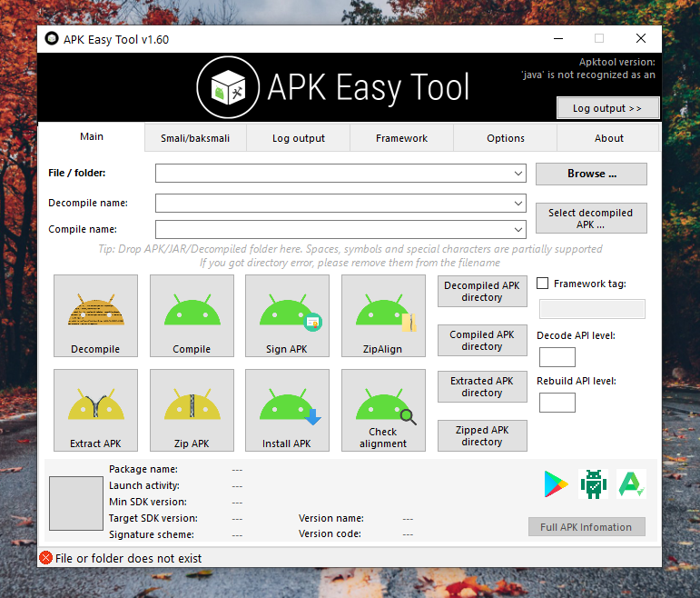

<h1 align="center">APK-EASY-TOOL</h1>
<h1 align="center"> </h1>
 
<h1 align="center"> </h1>
 
# APK EASY TOOL For PC / LAPTOP
# @Technical_Robot

# Apk-Easy-Tool-For-PC
Apk Easy Tool is a lightweight application that enables you to manage, sign, compile and decompile the APK files for the apps you are working on.
......
